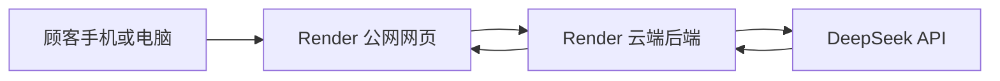

# NICE COFFEE 杯签诗生成器交付使用手册

## 1. 这是什么

这是一个咖啡杯签生成网页。顾客输入昵称和今日心情后，网页会调用 DeepSeek AI 生成一首简短的三行诗，并将诗句排版到 `40mm x 30mm` 杯签中。

杯签可以直接导出为图片，也可以打印后贴在咖啡杯上。



网页和后端都运行在 Render 云端。日常使用时，本地电脑可以关机。

---

## 2. 普通使用者：一分钟上手

### 2.1 打开网页

使用手机、平板或电脑浏览器打开管理员提供的 Render 公网链接，例如：

```text
https://coffee-label-poet.onrender.com
```

如果使用的是 Render 免费服务，长时间无人访问后，首次打开可能需要等待约一分钟。

### 2.2 输入访问码

如果页面显示访问验证框，输入管理员提供的访问码。

访问码不是 DeepSeek API Key。不要向任何人索要或发送 API Key。

### 2.3 生成一张杯签

1. 在“昵称”中输入顾客昵称，例如 `小雨` 或 `vivia`。
2. 在“今日心情”中填写一句话，或点击快捷选项。
3. 选择诗歌语言：
   - `中文诗`
   - `English`
4. 选择诗签风格：
   - `现代`
   - `古风`
   - `治愈`
   - `俏皮`
5. 选择生成模型：
   - `高质量`：使用 `deepseek-v4-pro`，适合正式出杯。
   - `快速`：使用 `deepseek-v4-flash`，适合快速测试。
6. 点击“生成三行诗”。

生成成功后，页面会提示：

```text
DeepSeek 高质量模型已生成
```

或：

```text
DeepSeek 快速模型已生成
```

### 2.4 检查杯签

生成后，请先检查：

- 三行诗是否通顺。
- 昵称中的字或字母是否自然分散在诗句中。
- 标签中的文字是否完整，没有超出边框。
- 日期是否正确。
- 杯签左上角是否显示 `NICE COFFEE`。

不满意时，可以再次点击“生成三行诗”或右侧的重新生成按钮。

### 2.5 导出图片

- 导出当前杯签：点击“导出图片”。
- 批量导出历史杯签：
  1. 在历史签中勾选需要导出的标签。
  2. 也可以点击“全选”或“全不选”。
  3. 点击“导出选中”。

每次生成新标签后，系统默认只选中新生成的一张，不会自动勾选之前的历史签。

### 2.6 打印标签

1. 点击“打印标签”。
2. 在打印机设置中选择实际标签纸尺寸：`40mm x 30mm`。
3. 打印缩放建议选择 `100%` 或“实际大小”。
4. 先试打一张，确认位置无误后再批量打印。

不同打印机的边距略有差异。第一次使用某台打印机时，建议先用普通纸测试。

---

## 3. 管理员：本地运行

本地运行用于修改页面、测试新功能。仅在本机测试时需要执行。

### 3.1 环境要求

电脑需要安装：

- Windows PowerShell
- Node.js `18` 或更高版本
- 项目文件夹

项目默认位置：

```text
D:\CodexProjects\coffee-label-poet
```

### 3.2 首次配置

进入项目目录：

```powershell
cd D:\CodexProjects\coffee-label-poet
```

如果还没有 `.env` 文件，复制模板：

```powershell
Copy-Item .env.example .env
```

用文本编辑器打开 `.env`，填写本地配置：

```text
DEEPSEEK_API_KEY=你的 DeepSeek API Key
DEEPSEEK_MODEL=deepseek-v4-pro
ACCESS_CODE=你设置的测试访问码
ACCESS_TOKEN=一串足够长的随机字符
ALLOWED_ORIGINS=http://127.0.0.1:3000
PORT=3000
HOST=127.0.0.1
```

说明：

| 配置项 | 用途 |
| --- | --- |
| `DEEPSEEK_API_KEY` | DeepSeek 密钥，只能保存在 `.env` 或 Render 后台。 |
| `DEEPSEEK_MODEL` | 后端兜底模型，建议使用 `deepseek-v4-pro`。 |
| `ACCESS_CODE` | 测试人员在网页中输入的访问码。 |
| `ACCESS_TOKEN` | 后端内部令牌，不要发给使用者。 |
| `ALLOWED_ORIGINS` | 允许访问后端的网页地址。 |
| `PORT` | 本地端口，默认 `3000`。 |
| `HOST` | 本地监听地址，默认 `127.0.0.1`。 |

### 3.3 启动本地网页

在项目目录执行：

```powershell
npm start
```

看到下面的提示说明启动成功：

```text
Coffee label poet is running at http://127.0.0.1:3000
```

然后打开：

[http://127.0.0.1:3000/](http://127.0.0.1:3000/)

如果 `3000` 端口被其他程序占用，服务会尝试备用端口。请以终端实际显示的地址为准。

### 3.4 关闭本地网页

如果网页服务正在当前 PowerShell 窗口运行，按：

```text
Ctrl + C
```

如果网页在后台运行，可以执行：

```powershell
Get-CimInstance Win32_Process |
  Where-Object { $_.CommandLine -like '*node server.js*' -or $_.CommandLine -like '*node  server.js*' } |
  Select-Object ProcessId, Name, CommandLine
```

找到对应的 `node.exe` 进程编号后执行：

```powershell
Stop-Process -Id 进程编号 -Force
```

示例：

```powershell
Stop-Process -Id 12345 -Force
```

---

## 4. 管理员：Render 公网部署

### 4.1 为什么使用 Render Web Service

这个项目不是单纯的静态网页。它还需要后端安全保存 DeepSeek API Key，并替网页请求 AI。

因此，在 Render 中必须创建：

```text
Web Service
```

不要选择：

```text
Static Site
```

### 4.2 部署前准备

确认代码已经上传到 GitHub 仓库。

GitHub 仓库可以设为私有。Render 连接 GitHub 后，只需要授权访问这个项目仓库。

不要将以下内容上传到 GitHub：

```text
.env
*.log
node_modules
```

项目已经通过 `.gitignore` 排除这些文件。

### 4.3 在 Render 创建服务

1. 登录 [Render Dashboard](https://dashboard.render.com/)。
2. 点击 `New +`。
3. 选择 `Web Service`。
4. 选择 GitHub，并连接对应仓库。
5. 选择项目仓库。
6. 填写配置：

| 项目 | 填写内容 |
| --- | --- |
| `Name` | `coffee-label-poet` 或其他未被占用的名称 |
| `Language` | `Node` |
| `Branch` | `main` |
| `Root Directory` | 仓库根目录就是本项目时留空 |
| `Build Command` | `npm install` |
| `Start Command` | `npm start` |
| `Instance Type` | 测试阶段可选择 `Free` |

7. 在 `Environment Variables` 中添加：

```text
DEEPSEEK_API_KEY=你的 DeepSeek API Key
DEEPSEEK_MODEL=deepseek-v4-pro
ACCESS_CODE=你设置的访问码
ACCESS_TOKEN=一串足够长的随机字符
ALLOWED_ORIGINS=https://你的-render域名.onrender.com
```

8. 点击创建服务。

部署完成后，Render 会提供公网地址，例如：

```text
https://coffee-label-poet.onrender.com
```

### 4.4 配置允许访问的域名

`ALLOWED_ORIGINS` 必须填写完整公网地址，包含 `https://`，不要在末尾添加 `/`。

正确示例：

```text
https://coffee-label-poet.onrender.com
```

错误示例：

```text
coffee-label-poet.onrender.com
https://coffee-label-poet.onrender.com/
```

如果需要同时允许多个网页地址，使用英文逗号分隔：

```text
https://coffee-label-poet.onrender.com,http://127.0.0.1:3000
```

### 4.5 使用 Blueprint 部署

项目根目录包含：

```text
render.yaml
```

也可以在 Render 中使用 Blueprint 创建服务。敏感信息仍然需要在 Render 后台手动填写，不要写入 `render.yaml`。

---

## 5. 更新公网版本

### 5.1 提交代码到 GitHub

在项目目录执行：

```powershell
cd D:\CodexProjects\coffee-label-poet
git status -sb
```

确认没有 `.env` 出现在待提交列表中。

然后提交代码：

```powershell
git add .env.example README.md HANDOFF_GUIDE.md index.html render.yaml script.js server.js styles.css
git commit -m "Update coffee label poet"
git push origin main
```

### 5.2 Render 自动更新

如果 Render 开启了自动部署，推送到 GitHub 的 `main` 分支后，Render 会自动重新部署。

在 Render 服务页面的 `Events` 或部署记录中查看进度。

如果关闭了自动部署，请在 Render 后台手动触发部署最新提交。

### 5.3 发布后检查清单

使用手机打开公网网页并测试：

- 网页可以打开。
- 访问码可以通过。
- `高质量` 模型可以生成诗句。
- `快速` 模型可以生成诗句。
- 中文诗和英文诗都能生成。
- 标签文字没有超出边框。
- 导出图片与网页预览基本一致。
- “全选”“全不选”“导出选中”可以正常使用。
- 打印尺寸为 `40mm x 30mm`。

---

## 6. 安全要求

### 6.1 绝对不要公开的内容

以下内容只能保存在本地 `.env` 或 Render 后台：

```text
DEEPSEEK_API_KEY
ACCESS_TOKEN
```

不要：

- 将 DeepSeek API Key 写进 `index.html` 或 `script.js`。
- 将 `.env` 上传到 GitHub。
- 将 `.env` 发给普通使用者。
- 在截图中暴露完整密钥。
- 将密钥粘贴到聊天群或公开文档中。

### 6.2 可以告诉使用者的内容

可以发送：

- Render 公网链接。
- 访问码 `ACCESS_CODE`。
- 普通使用说明。

### 6.3 测试阶段注意事项

当前项目已经具备：

- API Key 后端保存。
- 访问码验证。
- 来源域名限制。
- 输入长度限制。
- 模型白名单。

当前版本暂未加入频率限制。只建议发给可信任的人测试，不要直接公开传播。

---

## 7. 常见问题

### 7.1 网页第一次打开很慢

原因：Render 免费 Web Service 长时间没有请求后会休眠。

处理：等待约一分钟，再刷新页面。

### 7.2 页面能打开，但生成诗句失败

检查：

1. Render 服务是否正在运行。
2. `DEEPSEEK_API_KEY` 是否填写正确。
3. DeepSeek 账户是否有可用余额。
4. `ALLOWED_ORIGINS` 是否与公网链接完全一致。
5. Render 日志中是否显示 API 报错。

### 7.3 页面显示“DeepSeek 暂不可用，已使用本地模板”

这表示网页没有拿到可用的 AI 结果，已经自动使用本地模板。

检查 DeepSeek Key、模型配置、账户余额和 Render 日志。

### 7.4 页面显示历史记录，没有请求 AI

这是正常行为。网页打开后会优先展示上一次记录。

点击“生成三行诗”或重新生成按钮，才会发起新的 DeepSeek 请求。

### 7.5 本地端口不是 3000

原因：`3000` 端口可能被其他程序占用。

处理：查看启动终端显示的实际地址。项目会依次尝试备用端口：

```text
8787
8080
5173
```

### 7.6 文字超出标签边框

当前版本会自动缩小字号，并限制 AI 单行长度。

如果仍然出现问题：

1. 截图保留问题杯签。
2. 记录昵称、心情、语言、风格和模型。
3. 将信息交给维护人员排查。

### 7.7 导出图片和网页预览略有差异

浏览器字体和导出图片使用的字体渲染方式不同，细微差异属于正常现象。

如果出现明显字号过小、文字出框或留白异常，需要交给维护人员修复。

### 7.8 Render 免费服务有哪些限制

Render 官方说明：免费 Web Service 连续 `15` 分钟没有收到请求后会休眠，下一次请求会重新唤醒服务。免费服务适合测试和小范围使用，不建议直接作为正式生产环境。

---

## 8. 项目文件说明

| 文件 | 用途 |
| --- | --- |
| `index.html` | 网页结构。 |
| `styles.css` | 网页样式、标签布局和打印样式。 |
| `script.js` | 页面交互、历史签、导出图片和前端校验。 |
| `server.js` | Node 后端、访问验证和 DeepSeek 请求。 |
| `.env.example` | 本地配置模板，不包含真实密钥。 |
| `.env` | 本地真实配置，不允许提交。 |
| `render.yaml` | Render Blueprint 配置。 |
| `README.md` | 项目简要说明。 |
| `HANDOFF_GUIDE.md` | 本交付手册。 |

---

## 9. 官方资料

- [Render Web Service 文档](https://render.com/docs/web-services/)
- [Render 免费服务说明](https://render.com/free)
- [Render 环境变量说明](https://render.com/docs/environment-variables)
- [Render Blueprint 配置说明](https://render.com/docs/blueprint-spec)
- [DeepSeek API 文档](https://api-docs.deepseek.com/)
